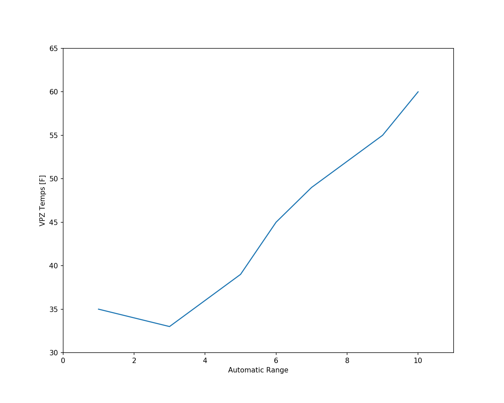

### Line Plots

There are many different types of plots that can be made via the matplotlib module, but one of the most common types of plots is a simple line plot. In meteorology these plots are often time series visualizations of data, whether that be observations (e.g., meteorograms), model output (e.g., forecast meteorograms), or statistical aspects of weather and climate observations.

Here is an example of a simple line plot using made-up temperature data. Where x is a variable containing our "time" array, y are a series of temperatures that occur at the various times. The shape (length) of x and y must be the same to be able to have matplotlib plot the line.

```python
import matplotlib.pyplot as plt

x = [1,2,3,4,5,6,7,8,9,10]
y = [35,34,33,36,39,45,49,52,55,60]

# Set up figure
plt.figure(figsize=(10,8))

# Plot the line of y values along x
plt.plot(x,y)

# Limit the axis view
plt.axis([0,11,30,65])

# Set some labels
plt.xlabel('Automatic Range')
plt.ylabel('VPZ Temps [F]')

# Show the created figure
plt.show()
```

This code yields the following image



There are many ways to further customize this image and I encourage you to go to the matplotlib [website](https://matplotlib.org/api/pyplot_summary.html) to see all of the different functionality for creating customized [plots](https://matplotlib.org/api/_as_gen/matplotlib.pyplot.plot.html#matplotlib.pyplot.plot) including, labels, tickmarks, linewidths, linestyles, etc.
